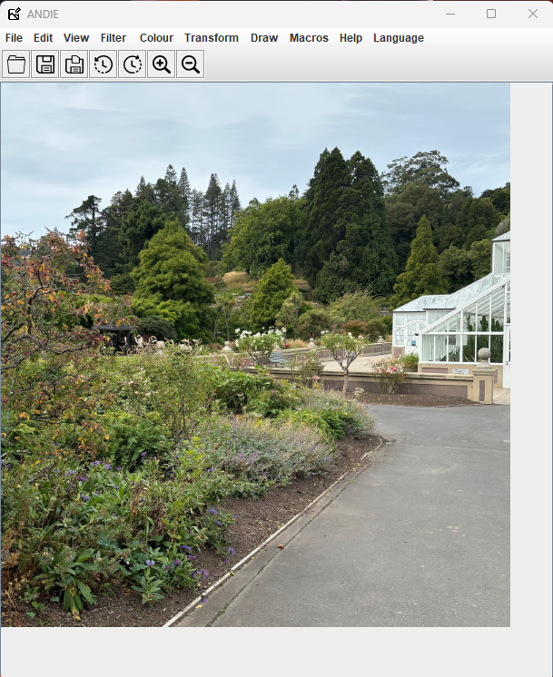

# ANDIE

This is **A** **N**on-**D**estructive **I**mage **E**ditor, built using Java Swing. It preserves the original image by saving an external operations file that are applied to images loaded into ANDIE. This is a group project for one of my university papers.

## Features

ANDIE contains numerous features that are commonly found in image editing applications. It is essentially a simplified version of Adobe Photoshop. The following sections will describe the functionality bundled within each menu, along with additional features that the user may find useful.

### File menu

This menu is pretty standard across all applications, containing operations for the user to open, save, and export their wonderful creations. As ANDIE is a non-destructive image editor, the save features in do not alter the original image - only exporting the image does. Lastly, there is a button to exit the program, which will give a suggestion to save all changes before doing so. The same warning is given when the user wants to load in a new image.

### Edit menu

Nothing too fancy in this menu, as it only contains the undo and redo operations, should the user change their mind.

### View menu

This menu contains the zoom in and zoom out operations, as well zooming back to the default zoom 
(100%). Again, a standard menu the user would have come across in many other applications. 

### Filter menu

Here is where the fun begins! ANDIE offers a wide variety of filters to spruce up the image, whether that is blurring filters (like the mean, median, and Gaussian filters), or edge detection filters (emboss and Sobel filters). Please note that the filter radius has been capped to 6 pixels, to prevent ANDIE from slowing down dramatically.

There are also some fun operations to distort or pixelate your image, using the random scatter and block averaging operations respectively. The user can choose the degree of scatter or pixelation they desire, using the informational dialogs within ANDIE. As usual, there are plenty of error handling for these filters and operations to prevent the user from doing something odd.

### Colour menu

This menu contains some basic operations that allows the user to change the colour of their images. The images can be made black and white with the greyscale operation, or have the colour channels jumbled up to see the images in a "different light". Colour inversion is also supported in ANDIE to reverse the colours of the image, and users can enter their percentage-based input to adjust the brightness and constrast of their images. Care has also been taken to preserve the alpha channels of all images, should they have them.

### Transform menu

As the name of the menu suggests, this menu contains operations that manipulate the size and orientation of images. The user can choose to mirror the image (using horizontal and vertical flips), or rotate the image (to the left, right or make it upside down), and resize the image (using a percentage-based input). Lastly, the user can also crop the image. However, please note that the a portion of the image must be selected prior to cropping the image.

### Language menu

Apart from English, ANDIE also supports French! Given their similarities, at least it won't be too hard to switch between the languages, should the user find themselves stuck in the wrong languge setting...

### Draw menu

ANDIE provides some limited drawing operations, which allows the user to draw shapes and lines. The shapes that can be drawn are ovals and rectangles, with the addtional option to draw them either as an outline, or as a solid shape. Just like the crop operation, please note that there must be an existing area selected on the image prior to drawing the lines/shapes.

### Macro menu

If the user is tired of applying the same operations to multiple images, worry no more! ANDIE has support for macros, allowing the user to record and save a series of operations to disk, and import them back in whenever the user wants to use them.

### Help menu

For all the power users out there, keyboard shortcuts are definitely the go-to when navigating around and using any application. Should the user want to explore all keyboard shortcuts offered in ANDIE, the Help menu has got them covered.

### Other features

There is also a toolbar that contains the typical operations for any image editing application, including opening and saving files, undo and redo operations, as well as changing the zoom level. For cropping and drawing operations, a popup menu will show up after selected an area, allowing for quick application of operations. Lastly, ANDIE has a save status indicator, reminding the user to save the changes they want to keep. This is represented as an asterisk in the application's frame, which appears when there are unsaved changes in ANDIE.

## Issues

### Macro Recordings

The menu item does not reset to 'Start recording' when a new image is loaded in. This could lead to unexpected results from the user's point of view. Also, crop and drawing functions are stored in the macro file, which can be problematic when applying them to other images. This is handled by displaying an error message to the user if the operations cannot be applied to the current image.

### Keyboard Shortcuts

On Windows, when the keyboard shortcuts for menu items are displayed, the some shortcuts contain English words. Unfortunately, it does not have equivalent translations when changing the locale and language displayed in the GUI.

### Dialogs

If the image was resized to be very large, the dialogs will try to roughly center itself relative to the enlarged image, rather than the center of the opened application (window frame).

### Deprecated Method

Within `Andie.java`, the `Locale(String, String)` constructor is used to construct the locale, which has been deprecated since since JDK 19. However, it still works as expected for ANDIE.

## Contributors

The following people were my team members who contributed to the project:

* Charlotte Williams
* Jennifer Puzey
* Layton Ford
* Ari Zuo

## License

Unless stated otherwise in source code documentation, all source files are licensed under [CC BY-NC-SA 4.0](https://creativecommons.org/licenses/by-nc-sa/4.0/). 

The initial commit for this repository contains the starting material for this project, provided by Steven Mills and the School of Computing at the University of Otago. The current state of the repository is the final product.